.. PyCon TW Slide documentation master file, created by
   sphinx-quickstart on Sat Jun  2 11:16:49 2012.
   You can adapt this file completely to your liking, but it should at least
   contain the root `toctree` directive.

=====================
 Welcome to PyCon JP
=====================

.. s6:: styles

   'h1': {fontSize: '10% !important'},

Welcome to PyCon JP
===================

.. s6:: styles

    h2: {fontSize:'150%', textAlign:'center', marginTop:'10%'},
    

- Shoma Hosaka

  - PyCon JP Spokesman

- PyCon Taiwan 2012

  - 2012/06/10

Who am I (お前、誰よ)
=====================

- Shoma Hosaka
    - twitter: `@shomah4a <http://twitter.com/shomah4a>`_
    - facebook: shomah4a

- PyCon JP 2012 Spokesman
- Japanese OTAKU
- Use Java at work

8 people joins from Japan
=========================

- `@terapyon <http://twitter.com/terapyon>`_

  - PyCon JP Chairman

- `@shimizukawa <http://twitter.com/shimizukawa>`_

  - PyCon JP Subchairman

- `@takanory <http://twitter.com/takanory>`_

  - PyCon JP Suponsor Support

- `@t2y <http://twitter.com/t2y>`_

  - PSF Member

8 people joins from Japan
=========================

- `@rokujyouhitoma <http://twitter.com/rokujyouhitoma>`_

  - pypy-ja Big Boss

- `@jbking <http://twitter.com/jbking>`_

  - pypy-ja Member

- `@24motz <http://twitter.com/24motz>`_

  - NVDA Japanese Team Leader

and me

About PyCon JP 2011
===================

.. s6:: styles

    h2: {fontSize:'150%', textAlign:'center', margin:'30% auto'}

About PyCon JP 2011
===================

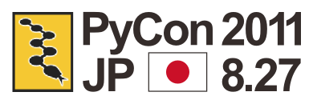

.. s6:: styles
   
   'div[0]': {position:'absolute', right:'0', top: '20%', width:'30%'}

- http://2011.pycon.jp/
- Held on Aug. 27-28, 2011

  - Conference: 27, Sprint: 28
  
- Participants: 247 people (staffs and sponsors included)
- Theme: “Python Meetup”

  - in Japanese “出会い系Python” (DEAIKEI Python)

  
Keynote speaker
===============

- Tarek Ziadé

  - twitter: `@tarek_ziade <http://twitter.com/tarek_ziade>`_

- Typical Products

  - Python3 Packaging
  - Expert Python Programming

.. figure:: /_static/expertpython.jpg

   Expert Python Programming

.. figure:: /_static/photos/keynote-tarek.JPG

   Tarek

.. s6:: styles

   'ul/li': {fontSize: '70%'},
   'div[0]': {position: 'absolute', right: '5%', top: '20%', width: '25%', 'font-size': '40%'},
   'div[1]': {position: 'absolute', left: '5%', bottm: '5%', width: '40%', 'font-size': '40%'},

What about "meetup"
===================

- Ice break
- Lunch
- Snack & Beverage time
- Party
- Sprint(Hack-a-thon)

..
   Theme of PyCon JP 2011 is "Meetup".
   We have prepared many time for talking between participants. 
   Because, Typically Japanese are so shy.
   Me too, of course.
   It's so fun.
   

.. figure:: /_static/photos/lunch-state.JPG

   Lunch

.. figure:: /_static/photos/party-komiya.JPG

   Party

.. figure:: /_static/photos/sprint-sphinx.jpg

   Sprint

.. s6:: styles

   'ul/li': {fontSize: '70%'},
   'div[0]': {position: 'absolute', right: '5%', top: '20%', width: '20%', 'font-size': '40%'},
   'div[1]': {position: 'absolute', left: '40%', bottom: '5%', width: '30%', 'font-size': '40%'},
   'div[2]': {position: 'absolute', left: '5%', bottom: '5%', width: '30%', 'font-size': '40%'},

2 people joined from Taiwan
===========================

.. figure:: /_static/photos/sinker-li.JPG

   Sinker Li

.. figure:: /_static/photos/Hsin-Yi-Chen.JPG

   Hsin-Yi Chen

.. s6:: styles
   
   'div[0]': {position: 'absolute', left: '5%', top: '20%', width: '35%', 'font-size': '40%'},
   'div[1]': {position: 'absolute', right: '5%', top: '20%', width: '45%', 'font-size': '40%'},

About PyCon JP 2012
===================

.. s6:: styles

    h2: {fontSize:'150%', textAlign:'center', margin:'30% auto'}

About PyCon JP 2012
===================

- http://2012.pycon.jp/en/
- Sep. 15, 16, 17

  - Conference: 15 16, Sprint: 17

- Venue

  - `Advanced Institute of Industrial Technology <http://aiit.ac.jp/english/>`_

- Theme: 「Connect Python」

  - In Japanese “つながるPython” (TSUNAGARU Python)

.. s6:: styles

   ul: {fontSize: '70%'},

..
  Last year's theme is 'Meetup'.
  It means "make friends".
  
  Then this year's theme is "Connect".
  It means "make more friendship" and "connection establishment to future"

Keynote Speaker
===============

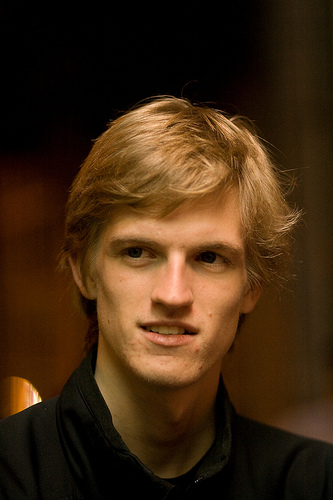

   Armin

.. s6:: styles

   'div[0]': {position: 'absolute', riht: '0', top: '20%', width: '30%', fontSize: '75%'},

- Armin Ronacher

  - twitter: `@mitsuhiko <http://twitter.com/mitsuhiko>`_

- Typical Products

  - flask
  - jinja2
  - werkzeug

More people joins from Taiwan
=============================

- PyCon JP 2011
- 2 people from Taiwan!
..
   4 times PyCon JP 2011

* PyCon Taiwan 2012
* 8 people from Japan!!

..
   4 times PyCon Taiwan 2012

- PyCon Japan 2012 (hope)
- 32 people from Taiwan!!!

..
  More people joins from Taiwan this year, We hope so.

.. s6:: styles

    'ul': {display:'none'},
    'ul[0]': {'font-size': '50%'},
    'ul[1]': {'font-size': '70%'},
    'ul[2]': {'font-size': '110%'},

.. s6:: actions

    ['ul[0]', 'fade in', '0.3'],
    ['ul[1]', 'fade in', '0.3'],
    ['ul[2]', 'fade in', '0.3'],

CFP Opened
==========

- CFP opend at the end of last month.
- http://2012.pycon.jp/en/cfp.html
- English track available

  - English CFP is welcome!

..
   We want your proposal!
   This year going to increase English session.
   We want a proposal of the session in English.

Schedule
========

- The end of June

  - CFP deadline

- In early July

  - Ticket sales start

- Sep. 15

  - PyCon JP 2012 start

..
   - The end of June
   - In early July
   - Sep. 15
   are very important dates.
   You must remember these dates today.
   If you remember their dates, please forget other contents in this session.

Around AIIT
===========

.. s6:: styles

    h2: {fontSize:'150%', textAlign:'center', margin:'30% auto'}

..
   By the way.
   Next is short introduction about around AIIT that venue of PyCon JP.
    

Around AIIT
===========

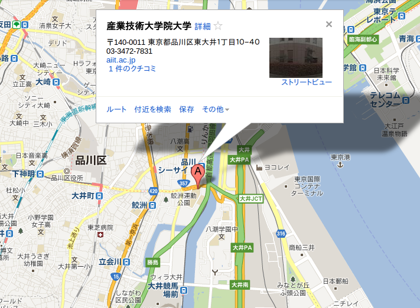

.. s6:: styles

   div: {width: '70%', textAlign: 'center', bottom: '0%', marginLeft: '15%'},

..
   AIIT is here.
   AIIT will arrive in approximately 30 minutes by train from Haneda Airport.

Around AIIT
===========

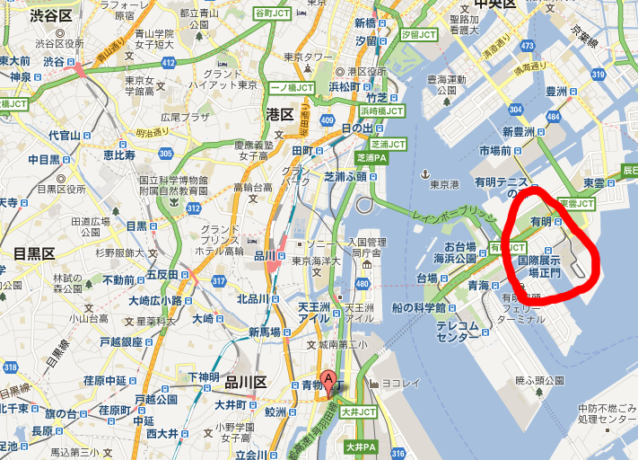

.. s6:: styles

   div: {width: '70%', textAlign: 'center', bottom: '0%', marginLeft: '15%'},

.. Attention here

Around AIIT
===========

..
   Here there is Tokyo Big Sight.
   To Tokyo Big Sight is 20 minutes by train from AIIT.
   
   Tokyo Big Sight is famous as venue of Comic Market.
   If you don't know about Comic Market, I recommend to search it.
   But, Comic Market of this summer was finished.
   next is the end of this year.
   
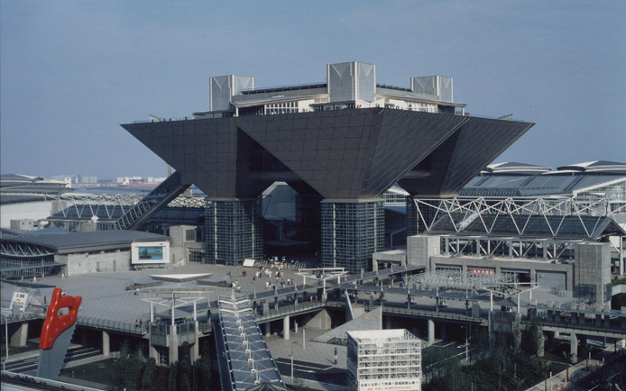

   Tokyo Big Sight

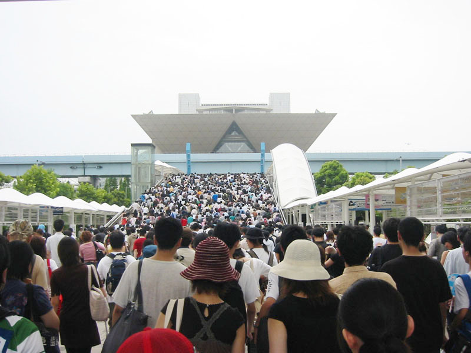

   日式 otaku festival

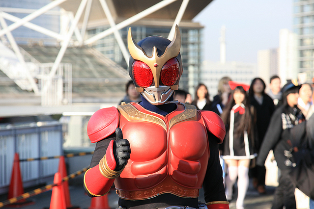

   日式 masked rider

.. s6:: styles

   'div[0]': {position: 'absolute', width: '40%', left: '5%', top: '20%', fontSize: '50%'},
   'div[1]': {position: 'absolute', width: '35%', right: '5%', top: '20%', fontSize: '45%'},
   'div[2]': {position: 'absolute', width: '35%', right: '30%', bottom: '0%', fontSize: '45%'},

Around AIIT
===========

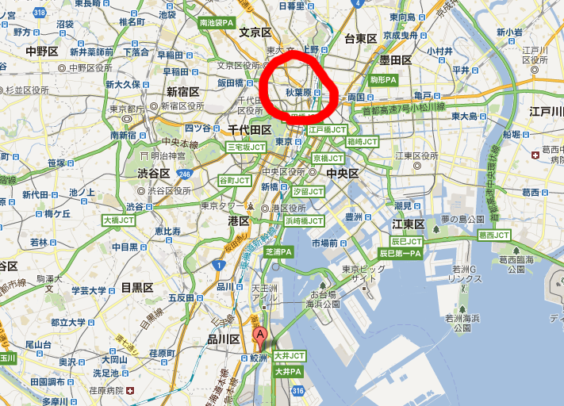

.. s6:: styles

   div: {width: '70%', textAlign: 'center', bottom: '0%', marginLeft: '15%'},

..
   Attention here

Around AIIT
===========

..
   I think you already know.
   Here there is Akihabara.

   To Akihabara is 40 minutes by train from AIIT.
   Akihabara is the city of the OTAKU, by the OTAKU, for the OTAKU.

   There are many place for sightseeing around AIIT.

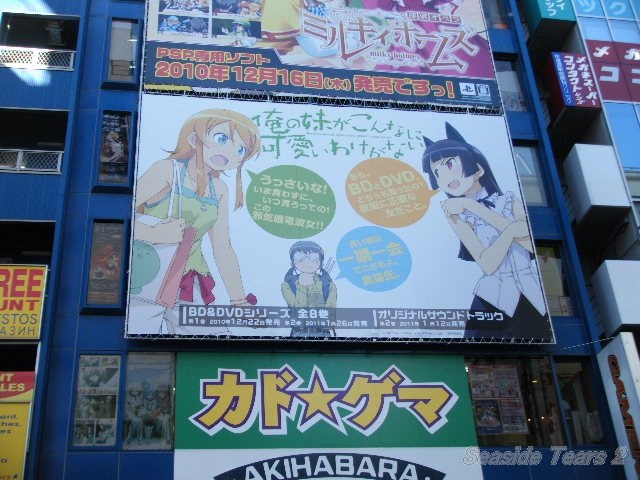

   日式 Billboard

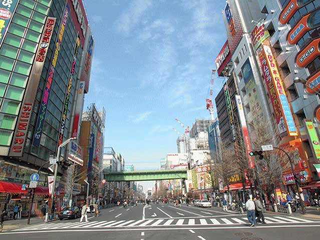

   Main street of Akihabara

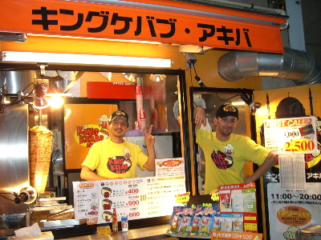

   日式 Soul food: Kebab

   
.. s6:: styles

   'div[0]': {position: 'absolute', width: '35%', left: '5%', top: '20%', fontSize: '50%'},
   'div[1]': {position: 'absolute', width: '35%', right: '5%', top: '20%', fontSize: '45%'},
   'div[2]': {position: 'absolute', width: '35%', right: '30%', bottom: '0%', fontSize: '45%'},

Summary
=======

- PyCon JP 2012 hold at Sep.15-17

  - We are waiting for YOUR proposal.
  - English session is welcome,

- We hope to see you at PyCon JP

Thanks for your attention
=========================

.. s6:: styles

    h2: {fontSize:'150%', textAlign:'center', margin:'30% auto'}

One more thing
==============

.. s6:: styles

    h2: {fontSize:'150%', textAlign:'center', margin:'30% auto'}

Please read
===========

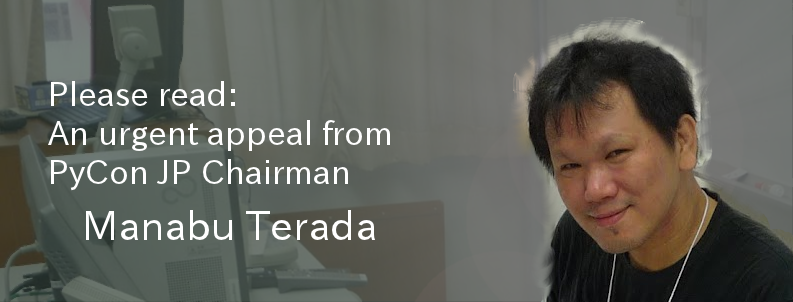

- Please tell us:

  - good restaurant or market
  - good place for sightseeing
  - souvenir of recomendations

.. s6:: styles

   h2: {display: 'none'},
   'div[0]': {position: 'relative', top: '0', right: '0', width: '100%'},

Thank you!
==========

.. s6:: styles

    h2: {fontSize:'150%', textAlign:'center', margin:'30% auto'}

